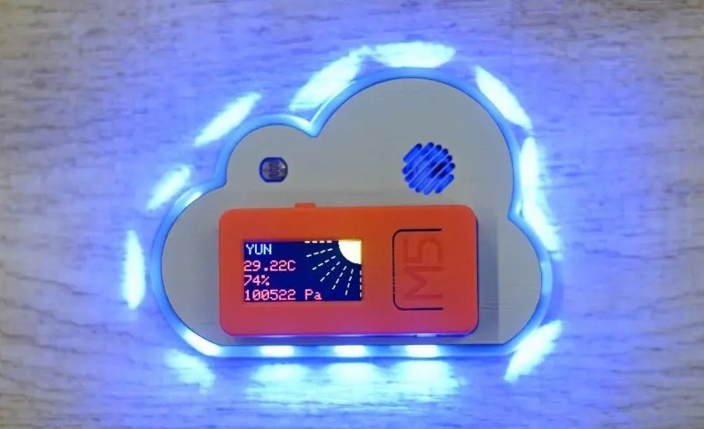
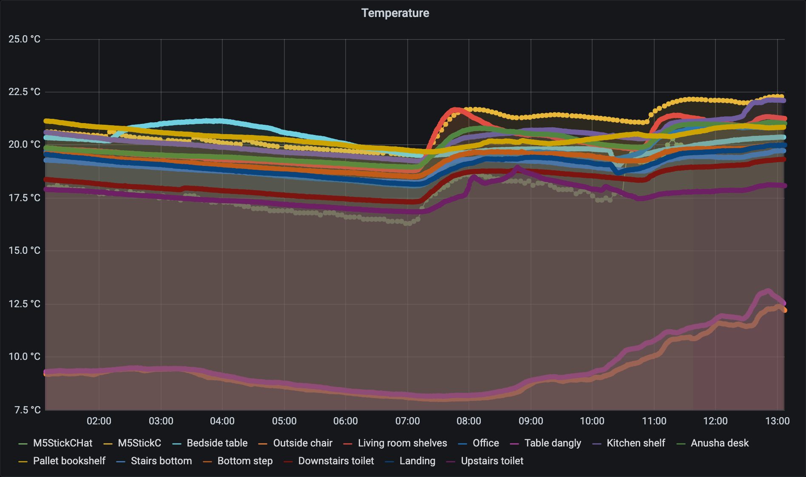
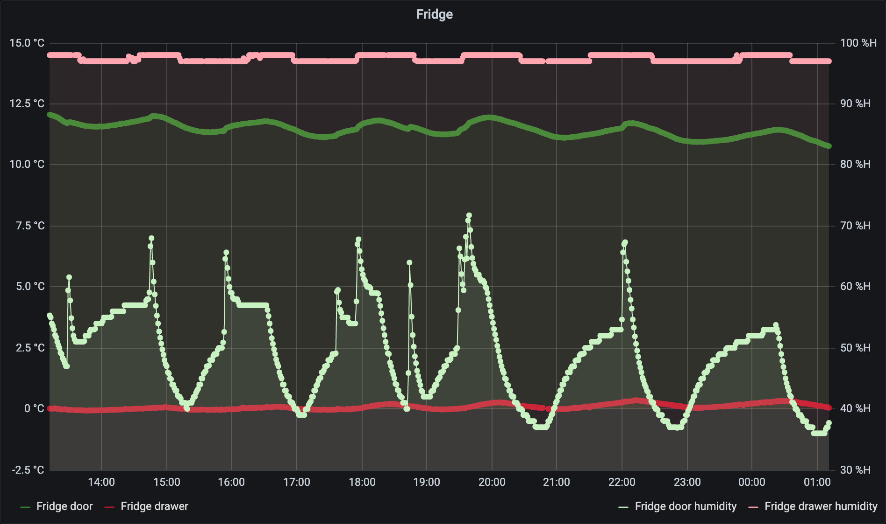
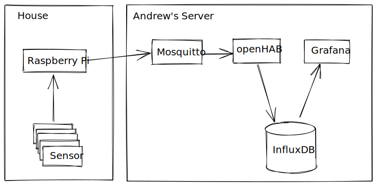
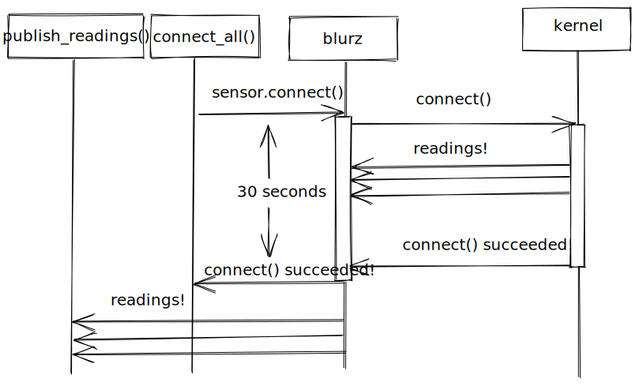
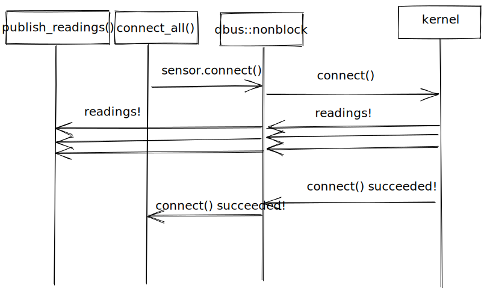
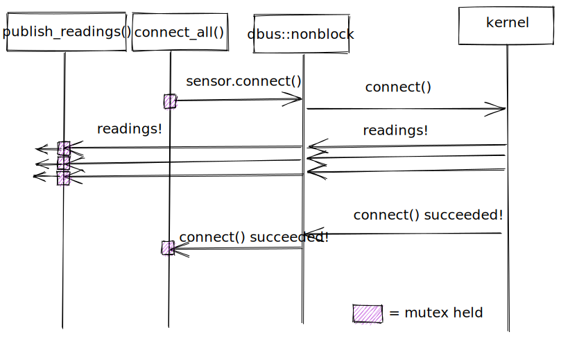

# Monitoring Temperature with Too Many Bluetooth Thermometers

- Binary Solo - 15th October 2020

- David Laban

---

# Outline

- Introduction

- System Overview

- Bluetooth Libraries

- Concurrency

- Software Engineering

- Links and Questions

---

# Introduction

- Housemate has a bunch of ESP32 sensors like this one

---

# Introduction

- Wouldn't it be nice to have a hundred of these?

- Just imagine what you could do.

- What's the cheapest way to do this?

---

# Introduction

- Let's start with 20.

---

# Introduction

- Obligatory Screenshot

---

# Introduction

- See also: fridge.

---

# System Overview

<!--
- Sensors
- Raspberry Pi
- Mosquitto (MQTT broker)
- openHAB
- InfluxDB
- Grafana
-->

---

# Bluetooth Libraries

- `blurz`

  - Started with this.
  - Blocking `device.connect()` calls.
  - Not multithreadded (because of how it uses D-Bus).
  - Unmaintained (for 2 years)

- `btleplug`

  - Mostly Async.
  - Talks directly to bluetooth stack over a socket.
  - Tried switching to this but gave up.

- `dbus-rs`
  - Async or Blocking (depending on which interface you use)
  - Generates code from introspection on the Raspberry Pi
  - Single-threaded in places (but that's okay).

---

# Concurrency

- Problem with single-threaded blocking bluetooth library:
  

---

# Concurrency

- Switch to async library:
  
- But you all know javascript, so I don't have to tell you this.

---

# Concurrency

- NOT SO FAST!
  
- What if all of your sensors live in a big `Arc<Mutex<SensorState>>`?

---

# Concurrency

- Hold the Mutex for as little time as possible.
  
- Much better.

---

# Concurrency

- `Arc<Mutex<ALL THE THINGS>`

  - Fine as long as you're careful.

  - Only hold the mutex when you _need_ it.

- `Stream<Item = Event>`

  - Kinda fine.

  - Not something that I use much in web-land.

- Unbounded Channels

  - Fine if you control the sender.

---

# Software Engineering

- Andrew is good at separating layers:

  - App -> Sensor (mijia) -> Bluetooth (bluez-generated) -> D-Bus.

  - App -> Homie (homie-device) -> MQTT.

  - [MQTT -> Homie (homie-controller) -> InfluxDB soon]

- Test coverage is not excellent. Sue me. 🤠

- Cross-compiling with `cross` is okay to set up, but a bit slow.

- Desktop Linux tech stack (D-Bus) is still a shitshow.

---

# Links and Questions

- Homie helper library https://crates.io/crates/homie-device

- GitHub: https://github.com/alsuren/mijia-homie/

- Demo?

- Questions?
