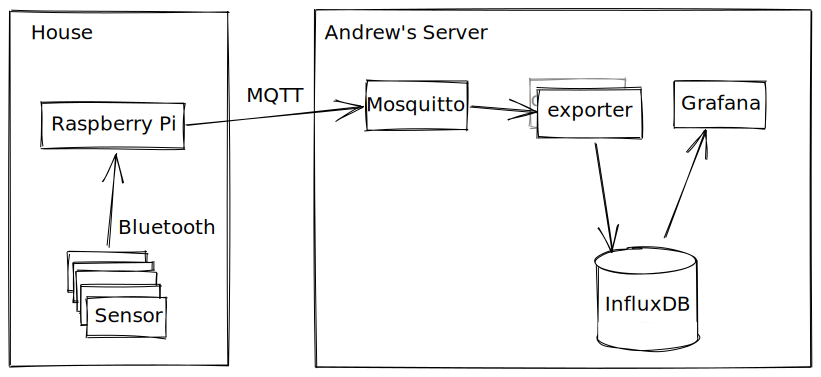

# Monitoring Temperature

<pre>(with too many bluetooth thermometers)</pre>

<pre>David Laban</pre>

<pre>Binary Solo - 15th October 2020</pre>

---

# Outline

- Backstory.

- System Overview.

- How it's built.

- Concurrency pitfalls.

- Observations about the project.

- Links and Questions.

---

# Backstory

- Housemate has a bunch of ESP32 sensors like this one

---

# Backstory

- "Wouldn't it be nice to have a hundred of these?"

- "Just imagine what you could do."

- "What's the cheapest way to do this?"

---

# Backstory

- So we bought some of these at `$3` each.

---

# Backstory

- And now we have graphs like this:

---

# Backstory

- And this:

---

# System Overview

- This is what it looks like:

  

- Orange is our code.

---

# System Overview

- This is the grand plan:

  

- Orange is our code.

--

- Let's dig into the different pieces.

---

# Rust

- Picked because of a [blog post](https://dev.to/lcsfelix/using-rust-blurz-to-read-from-a-ble-device-gmb) that I found.

- Rust is probably not the **best** language for this.

  - Bluetooth stack on linux is quite dynamic in places.

  - Cross-compiling with `cross` is okay to set up, but a bit slow.

  - We found a [Python project](https://github.com/JsBergbau/MiTemperature2) halfway through, doing the same.

<!-- prettier-ignore-start -->
<!--
  Indentation is bigger here because that's how much indentation remark needs
  to render a third-level bullet point.
  Ideally I would set tab width to 4 everywhere in prettier, but that makes
  prettier do strange things (https://github.com/prettier/prettier/issues/5019).
-->

- It was fun anyway:

    - Good chance to work on something together during lockdown.

    - We're both starting to use Rust for work, so good for learning.

        - Andrew is working on [crosvm](https://chromium.googlesource.com/chromiumos/platform/crosvm/) at the moment.

        - [FutureNHS](https://github.com/FutureNHS/futurenhs-platform/) is using Rust on the backend.

<!-- prettier-ignore-end -->

---

# MQTT

- MQTT is the pubsub of choice for low-powered gadgets.

- Has `retain`ed messages:

  - Lets you get the current status from the broker.

  - Avoids a round-trip to a power/network-constrained device.

- Has `LastWill` messages:

  - Lets the server clean up after you when you drop off the network.

- Homie is an auto-discovery convention built on MQTT.

- `rumqttc` library is pretty good:

  - Works using channels, which is nice.

  - You are responsible for polling its event loop.

  - Andrew has submitted patches, and they were well received.

---

# Bluetooth

The Rust Bluetooth story is a bit sad (all wrappers around BlueZ).

- `blurz` - "bluetooth from before there was tokio"

  - Started with this.
  - Talks to BlueZ over D-Bus (single-threaded).
  - Blocking `device.connect()` calls. 😧
  - Unmaintained (for 2 years).

- `btleplug` - "is that really how it's pronounced?"

  - Mostly Async and threadsafe (talks over raw sockets).
  - Theoretically cross platform.
  - Tried switching to this (but gave up after too many panicking threads).

- `dbus-rs` - "roll your own bluetooth library"
  - Generates code from D-Bus introspection.
  - Single-threaded because return types are !Send (but that's okay).
  - Async or Blocking (up to you).
  - Non-generated types are a bit **too** dynamic.

---

# Concurrency

- Problem with single-threaded blocking bluetooth library:
  

---

# Concurrency

- Switch to async library:
  
- But you all know javascript, so I don't have to tell you this.

---

# Concurrency

- NOT SO FAST!
  
- What if all of your sensors live in a big `Arc<Mutex<SensorState>>`?

---

# Concurrency

- Hold the Mutex for as little time as possible.
  
- Much better.

---

# Concurrency (tools that we use)

- `Arc<Mutex<ALL THE THINGS>`

  - Fine as long as you're careful.

  - Only hold the mutex when you _need_ it.

- `Stream<Item = Event>`

  - Kinda fine.

  - Just the async version of Iter, but with less syntax support.

  - Not something that I use much in web-land.

- Unbounded Channels

  - Fine if you know it's not going to back up.

---

# Observations about the project

- Andrew is good at separating things into modules (and crates):

  - App -> Sensor (mijia) -> Bluetooth (bluez-generated) -> D-Bus.

  - App -> Homie (homie-device) -> MQTT.

  - [MQTT -> Homie (homie-controller) -> InfluxDB soon]

- Deployment

  - Everything is supervised by systemd.

  - All managed by our `run.sh` script.

  - Test coverage is a bit thin. Sue me. 🤠

- Desktop Linux tech stack (D-Bus, Bluez) is still a shitshow.

- Raspberry Pi only supports 10 connected sensors (10 << 100).

---

# Links

- GitHub: https://github.com/alsuren/mijia-homie/

- Homie helper library https://crates.io/crates/homie-device

- Hacktoberfest https://hacktoberfest.digitalocean.com/

# Questions

- ?

--

# Question from me

- Does anyone have ideas about which graphs we should draw?
