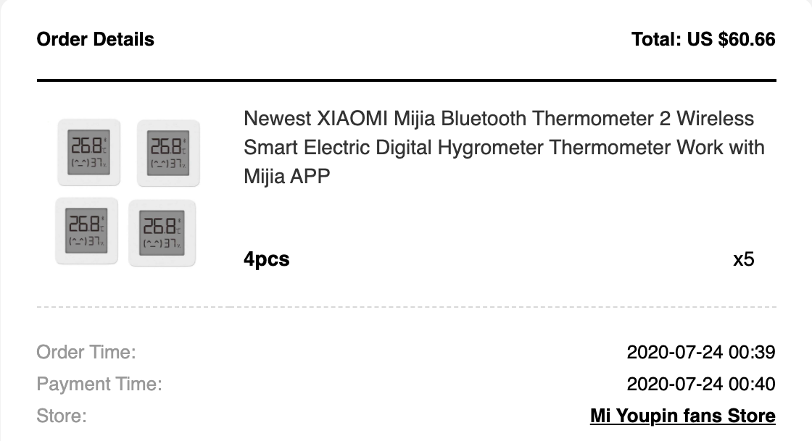
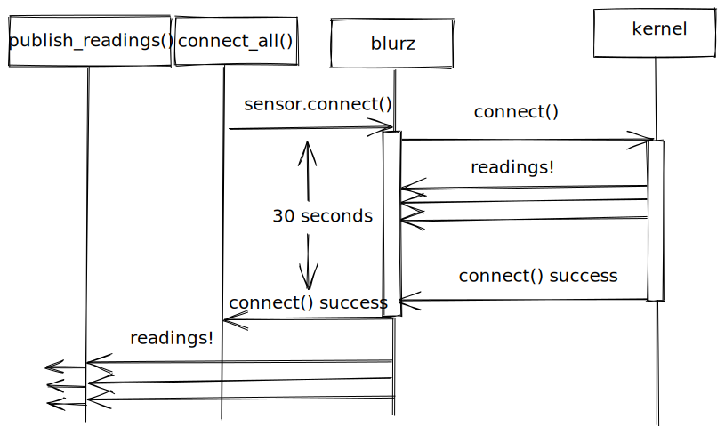
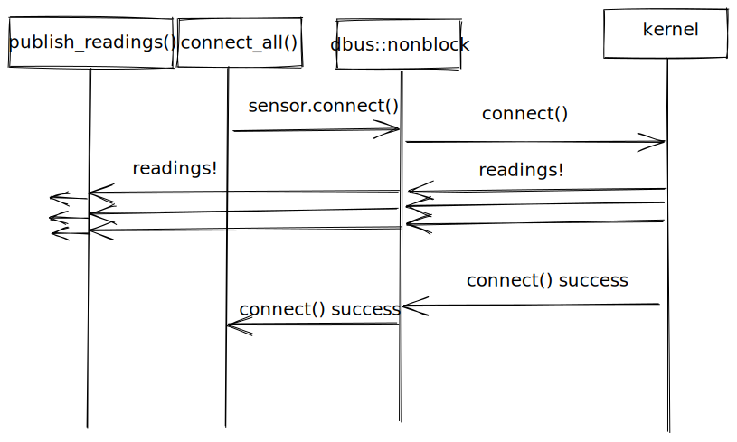
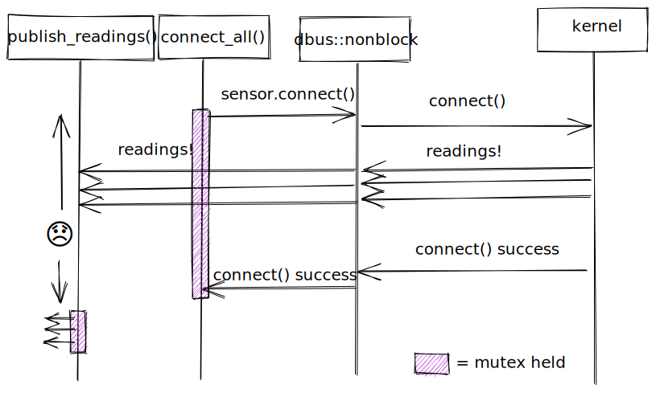
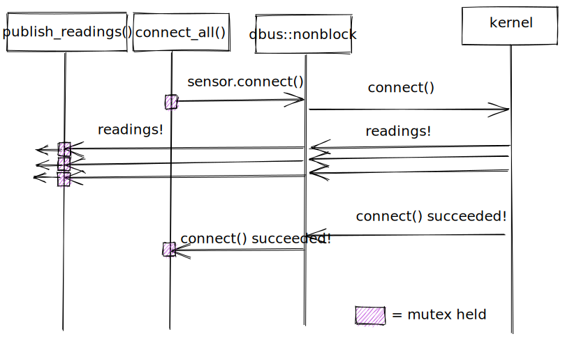
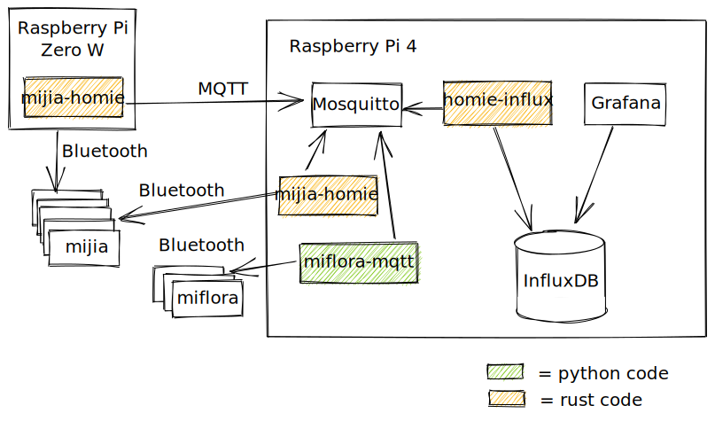
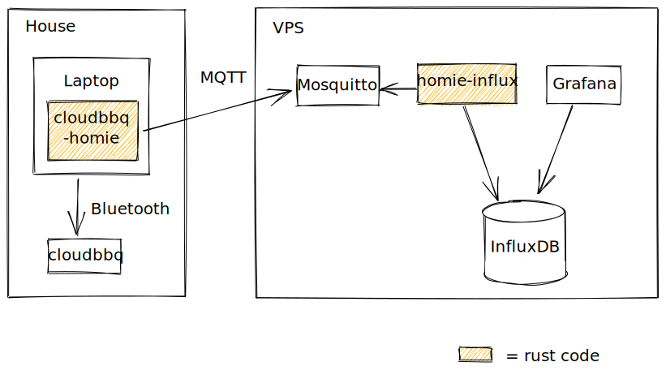

# Monitoring Temperature

(with too many Bluetooth thermometers)

David Laban

Rust London - 27 April 2021

---

# Outline

- TODO
<!--
- Backstory.

- System Overview.

- How it's built.

- Concurrency pitfalls.

- Observations about the project.

- Hall of Fame

- Links and Questions.

-->

---

# Backstory

- We started with a few ESP32 sensors like this:
  
- These cost around US$16 each, and Andrew couldn't get them running more than about a day on battery
  power.

???

ESP32 is a super-cheap system on chip with bluetooth and wifi

---

# Backstory

- "Wouldn't it be nice to have a hundred of these?"

- "Just imagine what you could do."

- "What's the cheapest way to do this?"

---

# Backstory

- So we bought some of these, at $3 each.

<!-- TODO: receipt for the other 80 -->

# System Overview

- This is what it looks like:
  

<!-- TODO: add `Orange is our code.` as a legend on the diagram -->

--

- Let's dig into the different pieces.

---

# Rust

<!-- FIXME: don't talk it down right at the beginning. Maybe move to observations -->

Picked because of a
[blog post](https://dev.to/lcsfelix/using-rust-blurz-to-read-from-a-ble-device-gmb) that I
found.

<!-- TODO: clickable links don't really make sense in slides -->

Rust is probably not the **best** language for this:

- Bluetooth stack on Linux is quite dynamic in places, due to its C and D-Bus heritage.

- Cross-compiling with `cross` is okay to set up, but iteration is slow.

- We found a [Python project](https://github.com/JsBergbau/MiTemperature2) partway through, with
  similar objectives.

<!-- prettier-ignore-start -->
<!--
  Indentation is bigger here because that's how much indentation remark needs
  to render a third-level bullet point.
  Ideally I would set tab width to 4 everywhere in prettier, but that makes
  prettier do strange things (https://github.com/prettier/prettier/issues/5019).
-->

--
<!-- TODO: split this slide at this point? -->

It was fun anyway:

  - Good chance to work on something together during lockdown.

  - We're both starting to use Rust for work, so good for learning.

      - Andrew is working on
        [crosvm](https://chromium.googlesource.com/chromiumos/platform/crosvm/) and
        [Virt Manager](https://android.googlesource.com/platform/packages/modules/Virtualization/+/refs/heads/master/virtmanager/)
        for Android.

      - David was using Rust for the backend of
        [FutureNHS](https://github.com/FutureNHS/futurenhs-platform/).

<!-- prettier-ignore-end -->

---

# MQTT

- MQTT is the pubsub of choice for low-powered gadgets.

- Has `retain`ed messages:

  - Lets you get the current status from the broker.

  - Avoids a round-trip to a power/network-constrained device.

- Has `LastWill` messages:

  - Lets the server clean up after you when you drop off the network.

- [Homie](https://homieiot.github.io/) is an auto-discovery convention built on MQTT.

- `rumqttc` library is pretty good:

  - Works using channels, which is nice.

  - You are responsible for polling its event loop.

  - Andrew has submitted patches, and they were well received.

---

# Bluetooth in 2020

<!-- TODO: make this into a thin summary slide and move interesting content to new slides -->

The Rust Bluetooth story is a bit sad.

- `blurz` - "Bluetooth from before there was Tokio"
  - We started with this.
  - Talks to BlueZ over D-Bus, but single-threaded and synchronous.
  - Blocking `device.connect()` calls. 😧
  - Unmaintained (for 2 years).

<!-- prettier-ignore-start -->

- `btleplug` - "cross-platform jumble"
  - Theoretically cross platform, but many features not implemented.
  - Linux implementation talked to kernel directly over raw sockets, bypassing BlueZ daemon.
      - Requires extra permissions, adds extra bugs.
  - Tried switching to this (but gave up after too many panicking threads).

<!-- prettier-ignore-end -->

- `dbus-rs` - "roll your own BlueZ wrapper"
  - Generates code from D-Bus introspection.
  - Single-threaded because return types are !Send (but that's okay).
  - Async or blocking.

---

# Concurrency

- Problem with single-threaded blocking Bluetooth library:
  

---

# Concurrency

- Switch to async library like we're used to in web-land:
  

--

- NOT SO FAST!

---

# Concurrency

- What if all of your sensors live in a big `Arc<Mutex<GlobalState>>`?
  

---

# Concurrency

- Hold the Mutex for as little time as possible.
  
- Much better.

---

# Concurrency (tools that we use)

<!-- TODO: maybe make a diagram for this? -->

- `Arc<Mutex<ALL THE THINGS>`

  - Easy refactor from `&mut ALL THE THINGS`

  - Fine as long as you know where the lock contention is.

  - Only hold the mutex when you _need_ it, and avoid holding over await points.

- Unbounded Channels

  - Fine if you know it's not going to back up.

- `Stream<Item = Event>`

  - Kinda fine.

  - Just the async version of Iter, but with less syntax support.

  - Not something that David uses much in web-land.

---

# Bluetooth in 2021

<!-- FIXME: link for bluez-async -->

We ended up building our own Bluetooth library: `bluez-async`

- Linux only
- BLE GATT Central only
- Typesafe async wrapper around BlueZ D-Bus interface.
- Sent patches upstream to `dbus-rs` to improve code generation and support for complex types.
- Didn't announce it anywhere, but issues filed (and a PR) by two other users so far.

--

<!-- FIXME: link for btleplug -->

Andrew has been contributing to btleplug

- Ported to use `bluez-async` on Linux.
- Exposes an async interface everywhere.
- There are a few bugs that need fixing before they make a release though.

<!-- TODO: Talk about how there is an effort in flight to make btleplug async, using bluez-async. -- https://github.com/deviceplug/btleplug/pull/114 -->

---

# Results

- Now we have graphs like this:

???

Point at things you are mentioning, like "start of the day"

---

# Results

- And this:

---

# Results

- Data can also be exported for use with pandas/plotly

---

<!-- TODO: related developments:

* bluez-async/btleplug/etc.
  * ???
* jupyter notebooks for analysis
* cloudbbq-homie
  * Architecture diagram
  * Graph of some meat
  * lamb = https://grafana.q.geek.nz/goto/xvwvw6XGk
* mi plant sensor
  * Architecture diagram
  * ->mqtt written in python
  * graphs
 -->

# Will's setup, with soil sensors

<!-- TODO: graphs -->

---

# CloudBBQ

<!-- TODO: graph -->

???

Backstory: one of the people who sent us patches was using it with a bbq meat thermometer, so I bought one for Andrew as a joke present.

---

# Observations about the project

- Separating things into modules (and crates) worked well:

  - App (`mijia-homie`) -> Sensor (`mijia`) -> Bluetooth (`bluez-async`) -> `bluez-generated` -> D-Bus.

  - App (`mijia-homie`) -> Homie (`homie-device`) -> MQTT.

  - MQTT -> Homie (`homie-controller`) -> `homie-influx` -> InfluxDB

- Deployment

  - Built with Github Actions and `cross`, packaged with `cargo-deb`.
    <!-- , hosted on Bintray. -->
    <!-- FIXME: except it's not, is it, because bintray is dead? -->
    <!-- cross compiling to ARM is a pain if you need c libs, but cross makes it okay -->
    <!-- cross compiling to ARM v6 even more of is a pain, as Will can testify, but we got there in the end -->

  - Everything is supervised by systemd.

  - Test coverage is a bit thin.

- Desktop Linux tech stack (D-Bus, BlueZ) is not great.
- Raspberry Pi only supports 10 connected BLE devices (10 << 100).
  - My laptop only supports 7.
  - We added a USB Bluetooth adapter, and got a second Raspberry Pi.

# Links

- GitHub: https://github.com/alsuren/mijia-homie

- Homie helper library https://crates.io/crates/homie-device

- Bluetooth library https://crates.io/crates/bluez-async

<!-- TODO: add all other links -->

# Questions

- ?

--

# Questions from me

- Does anyone have ideas about which graphs we should draw?
- What Bluetooth devices should we play with next?
